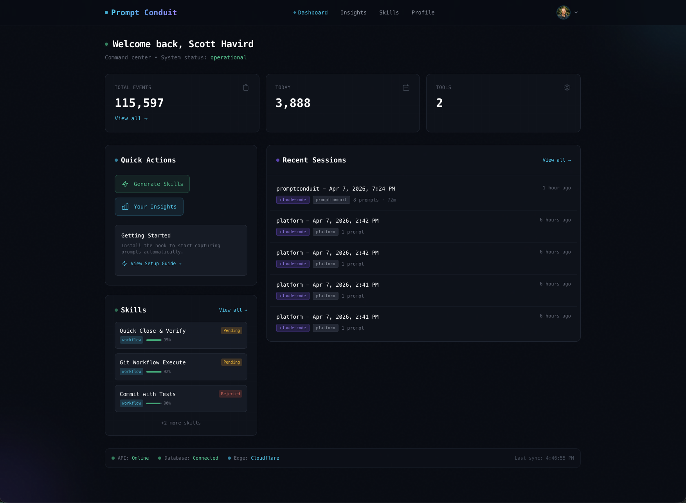

# PromptConduit CLI

Every great workflow you build in Claude Code disappears when the session ends. PromptConduit captures your AI coding sessions and turns repeated patterns into reusable slash commands — automatically, and without a platform account.

[](https://github.com/promptconduit/cli/actions/workflows/test.yml)
[](https://github.com/promptconduit/cli/stargazers)
[](https://opensource.org/licenses/MIT)
[](https://go.dev/dl/)

## No Account? Start Here

Turn your existing AI coding transcripts into reusable Claude Code skills — **no sign-up required**.

```bash
# Install
brew tap promptconduit/tap && brew install promptconduit

# Generate skills from your transcripts (uses your Claude Code subscription)
promptconduit skills generate --local
```

Skills are written directly to `~/.claude/skills/` and show up in Claude Code's `/` autocomplete immediately. Reads from Claude Code, OpenAI Codex CLI, and GitHub Copilot CLI — whichever you have installed.

[Jump to full local skills docs →](#local-skill-generation)

---

## Overview

PromptConduit CLI captures prompts, tool executions, and session events from AI coding assistants and forwards them to the PromptConduit platform for analysis and insights.

### Supported Tools

**Real-time hooks** (requires [platform account](https://promptconduit.dev)):

| Tool | Events Captured |
|------|-----------------|
| [Claude Code](https://claude.ai/code) | Prompts, Tools, Sessions, Attachments |
| [Cursor](https://cursor.com) | Prompts, Shell, MCP, Files, Attachments |
| [Gemini CLI](https://geminicli.com) | Prompts, Tools, Sessions |

**Local skill generation** (no account required):

| Tool | Transcript Location |
|------|---------------------|
| Claude Code | `~/.claude/projects/**/*.jsonl` |
| OpenAI Codex CLI | `~/.codex/**/*.jsonl` |
| GitHub Copilot CLI | `~/.copilot/session-state/**/*.jsonl` |

### Attachment Support

The CLI automatically extracts and uploads attachments from prompts:

- **Images**: JPEG, PNG, GIF, WebP, SVG, BMP, TIFF, HEIC
- **Documents**: PDF, Word (.doc/.docx), Excel (.xls/.xlsx), PowerPoint (.ppt/.pptx)
- **Text**: Plain text, CSV, HTML, Markdown, JSON, XML

## Installation

### Homebrew (Recommended)

```bash
brew tap promptconduit/tap
brew install promptconduit
```

### Quick Install Script

```bash
curl -fsSL https://promptconduit.dev/install | bash
```

Or with your API key pre-configured:

```bash
curl -fsSL https://promptconduit.dev/install | bash -s -- YOUR_API_KEY
```

### From Source

```bash
git clone https://github.com/promptconduit/cli.git
cd cli
make build
make install
```

### Download Binary

Download the latest release for your platform from the [releases page](https://github.com/promptconduit/cli/releases).

## Platform Quick Start

> **No account?** See [No Account? Start Here](#no-account-start-here) above.



### 1. Get your API key

Sign up at [promptconduit.dev](https://promptconduit.dev) and create an API key.

### 2. Configure your API key

```bash
promptconduit config set --api-key="your-api-key"
```

This saves your key to `~/.config/promptconduit/config.json`.

### 3. Install hooks for your tool

```bash
# For Claude Code
promptconduit install claude-code

# For Cursor
promptconduit install cursor

# For Gemini CLI
promptconduit install gemini-cli
```

### 4. Verify installation

```bash
promptconduit status
```

### 5. Test API connectivity

```bash
promptconduit test
```

## Commands

```bash
# Install hooks for a tool
promptconduit install <tool>

# Uninstall hooks from a tool
promptconduit uninstall <tool>

# Show installation status
promptconduit status

# Test API connectivity
promptconduit test

# Generate skills locally (no account needed)
promptconduit skills generate --local [flags]

# Generate skills via platform (requires account)
promptconduit skills generate [flags]

# Sync transcripts (manual)
promptconduit sync [tool] [flags]

# Show version
promptconduit version
```

### Sync Command

The `sync` command uploads historical conversation transcripts to the platform. **This is a manual process** - there is no automatic syncing of transcripts.

```bash
# Sync all supported tools
promptconduit sync

# Sync only Claude Code transcripts
promptconduit sync claude-code

# Preview what would be synced (no uploads)
promptconduit sync --dry-run

# Force re-sync already synced files
promptconduit sync --force

# Only sync transcripts newer than a date
promptconduit sync --since 2025-01-01

# Limit to N most recent transcripts
promptconduit sync --limit 10
```

**How it works:**
- Discovers JSONL transcript files from `~/.claude/projects/`
- Extracts conversation metadata, messages, and git context
- Tracks synced files in `~/.config/promptconduit/sync_state.json` to avoid duplicates
- Use `--dry-run` first to preview, then run without flags to sync

**Hooks vs Sync:**
- **Hooks** capture events in real-time during AI tool usage (automatic after installation)
- **Sync** uploads historical transcripts (must be run manually when needed)

### Local Skill Generation

Extract reusable skills from your AI coding transcripts — **no platform account required**. Uses your existing Claude Code subscription (or an API key) to analyze patterns and write skill files directly to `~/.claude/skills/`.

```bash
# Analyze all tools, write skills globally
promptconduit skills generate --local

# Analyze only Claude Code transcripts
promptconduit skills generate --local --tool claude-code

# Scope skills to current git repo
promptconduit skills generate --local --repo owner/repo

# Re-analyze previously seen transcripts
promptconduit skills generate --local --force

# Preview what would be generated
promptconduit skills generate --local --dry-run
```

**AI provider auto-detection** (in priority order):
1. `claude` CLI binary in PATH — uses your existing [Claude Code](https://claude.ai/code) / claude.ai Pro subscription
2. `ANTHROPIC_API_KEY` env var — direct Anthropic API access
3. `OPENAI_API_KEY` env var — OpenAI fallback (gpt-4o-mini)

**How it works:**
- Reads transcripts from Claude Code, OpenAI Codex CLI, and GitHub Copilot (whichever are installed)
- Requires ≥ 5 new conversations to detect patterns (use `--force` to override)
- Writes `SKILL.md` files with YAML frontmatter to `~/.claude/skills/<name>/`
- Tracks analyzed transcripts by SHA256 hash in `~/.config/promptconduit/local_skills_state.json`
- Skills appear immediately in Claude Code's `/` autocomplete

**Output example:**
```
Analyzing 47 local transcripts (global)...
Using Claude Code (claude CLI).

Detected 3 skills:

  /ci-monitor  (workflow, 90%)
    CI Monitor
    Check CI status and fix failures until green.
    → Written to: /Users/you/.claude/skills/ci-monitor/SKILL.md

3 skills written. Use them with /ci-monitor, etc.
```

## Configuration

The CLI supports multiple configuration methods with the following priority:

1. **Environment variables** (highest priority)
2. **Config file** (`~/.config/promptconduit/config.json`)
3. **Defaults** (lowest priority)

### Config File (Recommended)

The config file supports multiple environments, making it easy to switch between local development, staging, and production:

```bash
# Show current configuration
promptconduit config show

# Set API key for current environment
promptconduit config set --api-key=sk_your_key_here

# Set API URL (for local development)
promptconduit config set --api-url=http://localhost:8787

# Enable debug mode
promptconduit config set --debug=true

# Show config file path
promptconduit config path
```

### Multi-Environment Setup

Create environments for local, dev, and prod:

```bash
# Create local environment
promptconduit config env add local \
  --api-key=sk_local_key \
  --api-url=http://localhost:8787 \
  --debug

# Create dev environment
promptconduit config env add dev \
  --api-key=sk_dev_key \
  --api-url=https://dev-api.promptconduit.dev

# Create prod environment
promptconduit config env add prod \
  --api-key=sk_prod_key \
  --api-url=https://api.promptconduit.dev
```

### Switching Environments

```bash
# Switch environments
promptconduit config env use local
promptconduit config env use prod

# Shorthand alias
promptconduit config set-env local

# List all environments
promptconduit config env list

# Show current environment
promptconduit config show
```

**Important**: After switching environments, start a **new Claude Code session** for the hooks to pick up the new configuration. The `--continue` flag preserves the old environment.

### Environment Variables

Environment variables override config file settings:

| Variable | Required | Default | Description |
|----------|----------|---------|-------------|
| `PROMPTCONDUIT_API_KEY` | Yes | - | Your API key |
| `PROMPTCONDUIT_API_URL` | No | `https://api.promptconduit.dev` | API endpoint |
| `PROMPTCONDUIT_DEBUG` | No | `false` | Enable debug logging |
| `PROMPTCONDUIT_TIMEOUT` | No | `30` | HTTP timeout in seconds |
| `PROMPTCONDUIT_TOOL` | No | Auto-detect | Force specific adapter |

> **Warning**: If using multi-environment config, avoid setting `PROMPTCONDUIT_API_KEY` in your shell profile. The env var will override the config file's environment-specific key, which can cause mismatches (e.g., prod API key with local URL). Use the config file exclusively or env vars exclusively, but not both.

### Debug Mode

Enable debug mode to log hook activity:

```bash
# Via config
promptconduit config set --debug=true

# Via environment variable
export PROMPTCONDUIT_DEBUG=1
```

Debug logs are written to `$TMPDIR/promptconduit-hook.log` (on macOS this is typically `/var/folders/.../promptconduit-hook.log`).

## Architecture

```
┌─────────────────────────────────────────────────────────────┐
│                     AI Coding Tools                          │
├─────────────┬─────────────────────┬─────────────────────────┤
│ Claude Code │       Cursor        │      Gemini CLI         │
└──────┬──────┴──────────┬──────────┴───────────┬─────────────┘
       │                 │                      │
       └─────────────────┼──────────────────────┘
                         ▼
              ┌─────────────────────┐
              │   promptconduit     │  ← Hook receives raw JSON
              │      hook           │    from stdin
              └──────────┬──────────┘
                         │
              ┌──────────▼──────────┐
              │   Raw Envelope      │  ← Wraps event with
              │   + Git Context     │    metadata & repo state
              └──────────┬──────────┘
                         │
              ┌──────────▼──────────┐
              │    Async Send       │  ← Non-blocking POST to
              │  (subprocess)       │    /v1/events/raw
              └──────────┬──────────┘
                         │
              ┌──────────▼──────────┐
              │  PromptConduit API  │  ← Server-side adapters
              │  (normalization)    │    transform to canonical
              └─────────────────────┘
```

### Key Design Principles

- **Thin client**: The CLI wraps raw events in an envelope — all normalization happens server-side
- **Never blocks tools**: Hook always returns immediately with success
- **Async sending**: Events are sent in a detached subprocess
- **Rich context**: Captures git state (branch, commit, dirty files, etc.)
- **Attachment extraction**: Parses transcripts to extract images and documents
- **Multipart uploads**: Attachments sent efficiently via multipart form data
- **Graceful degradation**: Unknown events are silently skipped

## Canonical Event Schema

All events are normalized to this schema:

```json
{
  "tool": "claude-code",
  "event_type": "prompt_submit",
  "event_id": "uuid",
  "timestamp": "2024-01-01T00:00:00Z",
  "adapter_version": "1.0.0",
  "session_id": "...",
  "workspace": {
    "repo_name": "my-project",
    "repo_path": "/path/to/repo",
    "working_directory": "/path/to/repo"
  },
  "git": {
    "commit_hash": "abc123",
    "branch": "main",
    "is_dirty": true,
    "staged_count": 2,
    "unstaged_count": 1,
    "remote_url": "git@github.com:user/repo.git"
  },
  "prompt": {
    "prompt": "User's prompt text",
    "attachments": [
      {
        "filename": "image_1.png",
        "media_type": "image/png",
        "type": "image"
      }
    ]
  }
}
```

### Event Types

| Type | Description |
|------|-------------|
| `prompt_submit` | User submitted a prompt |
| `tool_pre` | Before tool execution |
| `tool_post` | After tool execution |
| `tool_failure` | Tool execution failed |
| `session_start` | Session started |
| `session_end` | Session ended |
| `agent_response` | Agent completed a response turn |
| `agent_response_failure` | Response turn ended due to API error |
| `subagent_start` | Subagent spawned |
| `task_created` | Task created (agent teams) |
| `task_completed` | Task completed (agent teams) |
| `teammate_idle` | Agent team teammate went idle |
| `permission_request` | Permission prompt shown |
| `permission_denied` | Tool call denied by auto mode |
| `context_compact` | Context compaction triggered |
| `context_compact_done` | Context compaction completed |
| `worktree_create` | Git worktree created |
| `worktree_remove` | Git worktree removed |
| `instructions_loaded` | CLAUDE.md or rules file loaded |
| `config_change` | Configuration file changed |
| `cwd_changed` | Working directory changed |
| `file_changed` | Watched file changed on disk |
| `mcp_elicitation` | MCP server requested user input |
| `mcp_elicitation_result` | User responded to MCP elicitation |
| `notification` | System notification sent |
| `shell_pre` | Before shell command (Cursor) |
| `shell_post` | After shell command (Cursor) |
| `file_read` | File read operation (Cursor) |
| `file_edit` | File edit operation (Cursor) |

### Headless Mode (claude -p)

PromptConduit hooks work in Claude Code's headless/print mode (`claude -p "..."`) without any changes. Hooks fire and capture events identically in both interactive and non-interactive sessions.

**`--bare` mode limitation:** When running `claude --bare -p "..."`, Claude Code skips auto-discovery of hooks and settings, so PromptConduit hooks will not fire. To capture events in bare mode, explicitly pass your settings file:

```bash
claude --bare -p "your prompt" --settings ~/.claude/settings.json
```

Note: `--bare` is expected to become the default for `-p` in a future Claude Code release. The `--settings` workaround ensures capture until that changes.

## Development

### Prerequisites

- Go 1.21+
- Git

### Building

```bash
# Build binary
make build

# Run tests
make test

# Build for all platforms
make build-all

# Create snapshot release
make snapshot
```

### Project Structure

```
.
├── cmd/                    # CLI commands
│   ├── root.go            # Root command
│   ├── install.go         # Install hooks for AI tools
│   ├── uninstall.go       # Remove hooks
│   ├── status.go          # Show installation status
│   ├── test.go            # Test API connectivity
│   ├── hook.go            # Hook entry point (receives raw events)
│   ├── config.go          # Config management
│   └── sync.go            # Transcript sync command
├── internal/
│   ├── envelope/          # Raw event envelope types
│   ├── client/            # HTTP client with multipart upload
│   ├── git/               # Git context extraction
│   ├── sync/              # Transcript sync and parsing
│   │   ├── claudecode.go  # Claude Code transcript parser
│   │   ├── state.go       # Sync state management
│   │   └── types.go       # Parser interface and types
│   └── transcript/        # Transcript parsing & attachment extraction
├── scripts/
│   └── install.sh         # Curl installer
├── .goreleaser.yaml       # Release configuration
├── Makefile               # Build commands
└── go.mod                 # Go module
```

## Privacy & Security

- **Open Source**: Full transparency on what data is captured
- **Minimal**: Only captures events needed for analysis
- **Secure**: HTTPS with API key authentication
- **Non-blocking**: Never interferes with your workflow

## License

[MIT](LICENSE) - Copyright (c) 2026 PromptConduit

## Links

- [PromptConduit Website](https://promptconduit.dev)
- [Documentation](https://promptconduit.dev/docs)
- [Issue Tracker](https://github.com/promptconduit/cli/issues)
